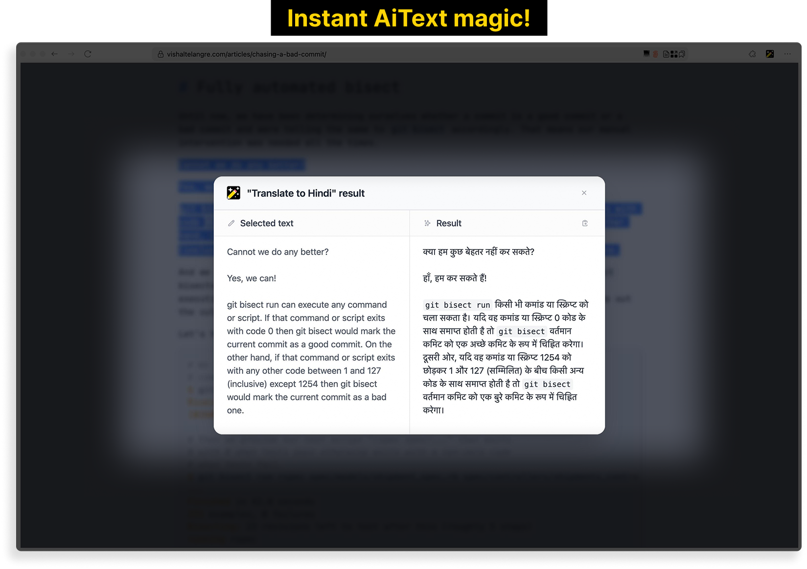
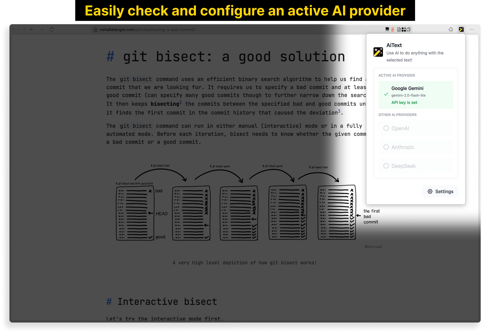
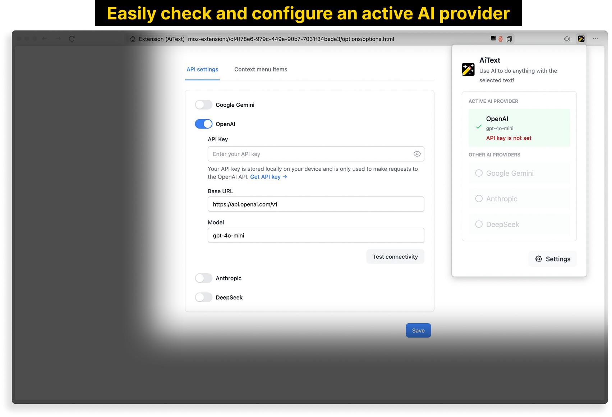

# AiText


A Firefox browser extension that allows you to use AI to do anything with the selected text.

## Screenshots









## Features

- [x] Select any text and right click to get a list of AI actions to perform with the selected text
- [x] Sensible and useful default context menu actions
- [x] Easily add custom context menu actions as needed
- [x] Ability to configure an AI provider, model, and API key
- [x] Support for Gemini, OpenAI, Anthropic, and DeepSeek
- [x] Markdown formatting for responses
- [x] Beautiful and simple UI

## Development Setup

### Prerequisites

- [Node.js](https://nodejs.org/)
- [pnpm](https://pnpm.io/) package manager

### Development Commands

Install the dependencies.

```bash
pnpm install
```

To build CSS and TypeScript files:

```bash
pnpm build
```

To watch for changes and rebuild on changes:

```bash
pnpm watch
```

### Loading the add-on in Firefox

1. Build the add-on.

```bash
pnpm build
```

2. Open Firefox and navigate to `about:debugging`.

3. Click on "This Firefox" in the left sidebar.

4. Click "Load Temporary Add-on".

5. Navigate to your project directory and select the `manifest.json` file.

6. The add-on should now be loaded and visible in the browser toolbar.

### Development Workflow

1. Run the watch command to automatically rebuild on changes.

   ```bash
   pnpm watch
   ```

2. After making changes and the build completes, go back to `about:debugging` and find the AiText add-on in the list.

3. Click the "Reload" button to update the add-on.

Note: The add-on will need to be reloaded in Firefox after each build to see your changes. Temporary add-ons are removed when Firefox is closed and will need to be loaded again the next time you open Firefox.

## Packaging

1. To package the add-on for distribution:

```bash
pnpm package
```

It will prompt you to enter a new version for the add-on and create a zip file in the root of the project called `ai-text-firefox-<version>.zip`.

2. Upload the zip file to the [Firefox Add-ons site](https://addons.mozilla.org/en-US/developers/addon/aitext/versions/submit/).

## License

This project is licensed under the MIT License. See the [LICENSE](LICENSE) file for details.
