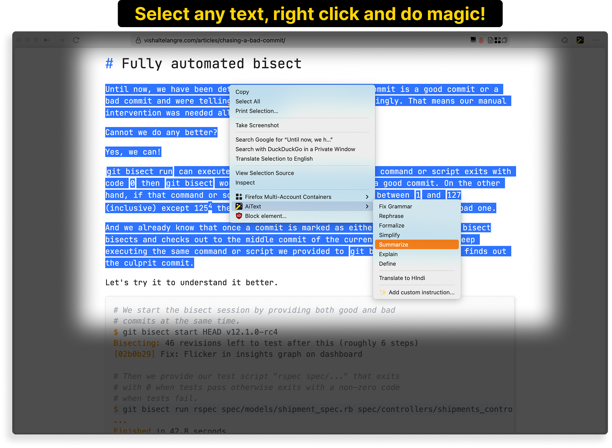
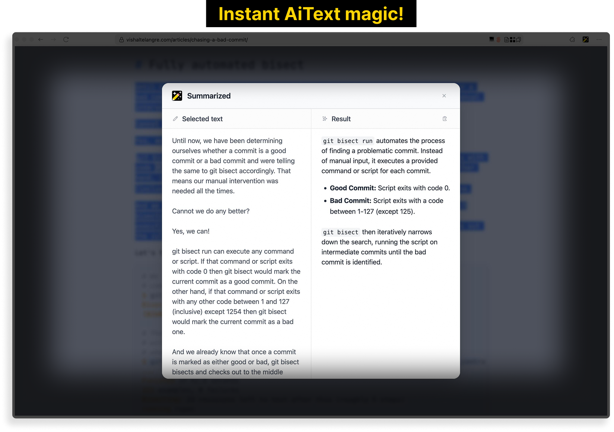

# AiText


A browser extension that allows you to use AI to do anything with the selected text.

**Available for both Firefox and Chrome.**

## Screenshots






## Features

- [x] Select any text and right click to get a list of AI actions to perform with the selected text
- [x] Sensible and useful default context menu actions
- [x] Easily add custom context menu actions as needed
- [x] Ability to configure an AI provider, model, and API key
- [x] Support for Gemini, OpenAI, Anthropic, and DeepSeek
- [x] Markdown formatting for responses
- [x] Beautiful and simple UI
- [x] Cross-browser support (Firefox and Chrome)

## Development Setup

### Prerequisites

- [Node.js](https://nodejs.org/)
- [pnpm](https://pnpm.io/) package manager

### Development Commands

Install the dependencies:

```bash
pnpm install
```

To build the extension for both browsers:

```bash
pnpm build
```

To watch for changes and rebuild on changes for both browsers:

```bash
pnpm watch
```

### Loading the add-on in Firefox

1. Build the extension:

```bash
pnpm build
```

2. Open Firefox and navigate to `about:debugging`.

3. Click on "This Firefox" in the left sidebar.

4. Click "Load Temporary Add-on".

5. Select the `dist-firefox/manifest.json` file.

6. The add-on should now be loaded and visible in the browser toolbar.

### Loading the extension in Chrome

1. Build the extension:

```bash
pnpm build
```

2. Open Chrome and navigate to `chrome://extensions`.

3. Enable "Developer mode" in the top right.

4. Click "Load unpacked".

5. Select the `dist-chrome` folder.

6. The extension should now be loaded and visible in the browser toolbar.

### Development Workflow

1. Run the watch command to automatically rebuild on changes:

   ```bash
   pnpm watch
   ```

2. After making changes and the build completes:
   - For Firefox: Go to `about:debugging`, find AiText and click "Reload"
   - For Chrome: Go to `chrome://extensions`, find AiText and click the refresh icon

Note: Temporary add-ons/extensions are removed when the browser is closed and will need to be loaded again the next time you open the browser.

## Packaging

To package the extension for distribution:

```bash
pnpm package
```

This will:

1. Prompt for a new version (or keep the current one)
2. Update version in manifest.json and package.json
3. Build the extension for both Firefox and Chrome
4. Create the following files in the `archives` directory:
   - `ai-text-firefox-<version>.zip` - Firefox distribution package
   - `ai-text-chrome-<version>.zip` - Chrome distribution package
   - `ai-text-source-<version>.zip` - Source code package for Mozilla review

Upload the appropriate zip file to:

- Firefox: [Firefox Add-ons site](https://addons.mozilla.org/en-US/developers/addon/aitext/versions/submit/)
- Chrome: [Chrome Web Store Developer Dashboard](https://chrome.google.com/webstore/devconsole)

## License

This project is licensed under the MIT License. See the [LICENSE](LICENSE) file for details.
